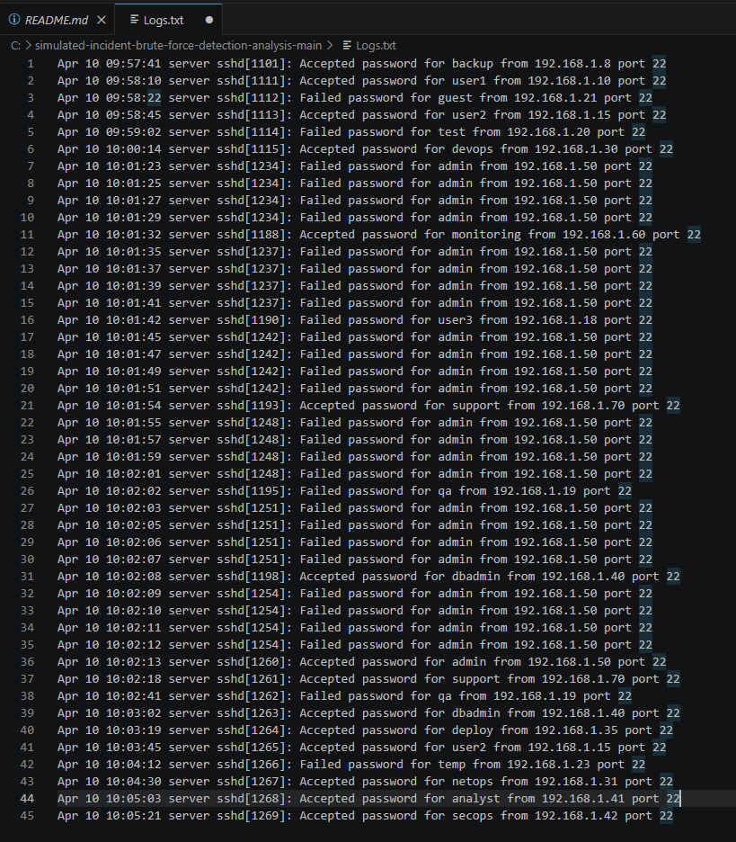

# SOC Labs – Raphael Orfali

Este repositório reúne estudos práticos em cibersegurança com foco em Blue Team, análise de logs e investigação inicial de incidentes.

---

## Lab 1 – Investigação de Brute Force

### Cenário
Este laboratório simula um caso de brute force contra uma conta com privilégio elevado em um servidor Linux exposto via SSH. O objetivo é analisar os eventos de autenticação, separar ruído de atividade suspeita e documentar a investigação como um caso de triagem inicial em SOC.

### Objetivo
Identificar se a sequência de autenticações observada indica tentativa de acesso não autorizado e justificar a classificação do incidente com base nos logs disponíveis.

---

### Principais Achados
- 26 falhas de autenticação via SSH para a conta `admin` em menos de 1 minuto.
- Origem: IP `192.168.1.50` (identificado nos logs)  
- Login bem-sucedido para a mesma conta após a sequência de falhas.
- Evidências compatíveis com brute force bem-sucedido e potencial comprometimento de credencial.

---

### Resumo do Incidente
Severidade: Alta

Status: Confirmado

MITRE ATT&CK: `T1110 - Brute Force`

IOC Principal: `192.168.1.50`

Conta Afetada: `admin`

Serviço Exposto: `SSH / port 22`

---

### Fontes de Dados
- Arquivo de log analisado: [Logs.txt](Logs.txt)
- Evidência visual: `evidence.png`
- Relatório técnico completo: [incident-report.md](incident-report.md)

---

### Fluxo de investigação
1. Revisão do arquivo de autenticação para separar eventos benignos e suspeitos.
2. Identificação de repetição de falhas para a mesma conta e mesma origem.
3. Validação de sucesso de autenticação após tentativas consecutivas.
4. Classificação do incidente com base em IOC, timeline, impacto e técnica MITRE.
5. Definição de ações imediatas de contenção e fortalecimento de controle.

---

### Ações Recomendadas
- Bloquear ou isolar temporariamente o IP de origem no firewall.
- Resetar a senha da conta afetada.
- Habilitar MFA para acessos administrativos.
- Revisar exposição do serviço SSH e políticas de bloqueio por tentativas.
- Correlacionar esse IOC com outras fontes de log para verificar atividade lateral.

---

## Evidências

Os logs analisados estão disponíveis abaixo:

Logs analisados: [Logs.txt](Logs.txt)

## Evidência Visual

---

### O que foi praticado
- leitura e interpretação de logs
- montagem de timeline
- triagem inicial de alertas
- identificação de IOC
- classificação de incidente
- definição de contenção e mitigação

---

## Observações
Os logs deste repositório representam um cenário simulado para fins de estudo e prática em investigação de incidentes.
